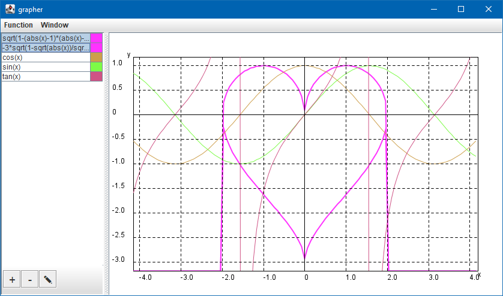

# Grapher

A software that uses Java's Swing toolkit to visualise functions using a list/table and an interactive graph.

## Function Actions

| List Action                           | Mouse Input        |
| ------------------------------------- | ------------------ |
| Select a function                     | Left Click         |
| Select/Deselect one or more functions | Ctrl + Left Click  |
| "                                     | Shift + Left Click |

| Table Action                        | Mouse Input        |
| ----------------------------------- | ------------------ |
| Select/Deselect a function          | Left Click         |
| Select/Deselect multiple functions  | Left Drag          |
| "                                   | Ctrl + Left Click  |
| "                                   | Shift + Left Click |
| Change a selected function's colour | Right Click        |

| Menu Action                  | Keyboard Shortcut |
| ---------------------------- | ----------------- |
| Add a function               | ---               |
| Edit a function              | ---               |
| Change a function's colour   | ---               |
| Remove one or more functions | Delete            |
| Undo actions                 | Ctrl + Z          |
| Redo actions                 | Ctrl + Shift + Z  |

> On a Mac, use the modifier `Command` key instead of `Ctrl` when using shortcuts

## Graph Interaction

| Interaction | Mouse Input |
| ----------- | ----------- |
| Move        | Left Drag   |
| Zoom In     | Left Click  |
| "           | Scroll Up   |
| "           | Right Drag  |
| Zoom Out    | Right Click |
| "           | Scroll Down |

## Layout

Two split panes are used for the whole layout. The first one is horizontal and contains the second split pane on its left and the graph on its right. While the second one is vertical and contains the function list/table on its top and the toolbar on its bottom.

The left of the horizontal split pane has a minimum size limit. And the components of the vertical split pane have fixed sizes (no divider).

## Implementation

### Actions

Actions are instanciated in a static instance of `Actions`, allowing them to be used anywhere.

### Graph

The graph is populated by the table through `FunctionTableListener`. Functions will show in black in list view and will show in colour in table view. The graph knows which view is in use through `ViewModeListener`. It updates functions stroke and colour upon respectively listening to the table through `FunctionTableListener` and reading the tables model.

### List & Table

The list uses `FunctionListModelFromTable` as its model which is populated by the table using `FunctionTableListener`. When a selection is made in the list, it transfers its selection to the table through `FunctionActionListeners`.

It is possible to change views between the list view and the table view going through the `Window` menu into `View mode`.

### Menu & Toolbar

The menu and the toolbar both make use of `Actions` to call the appropriate action after an item or a button press.

The toolbar buttons all have the same fixed maximum size.
